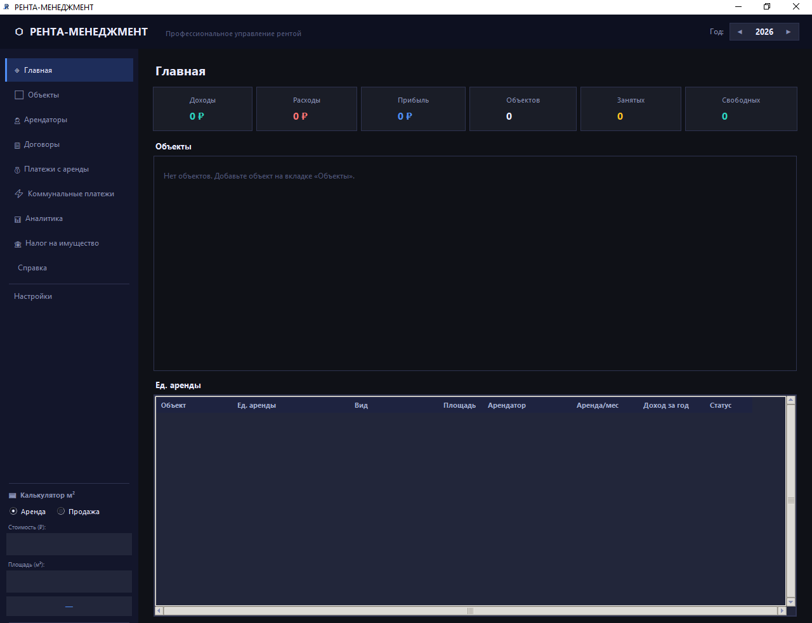
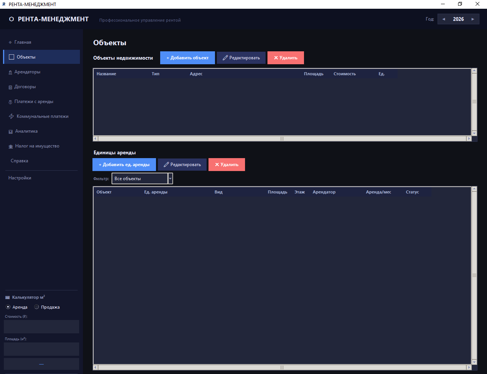
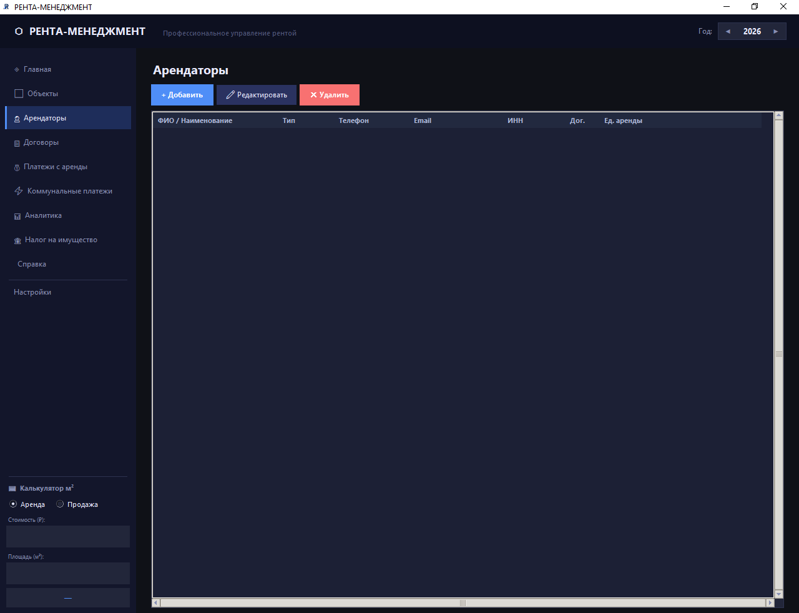
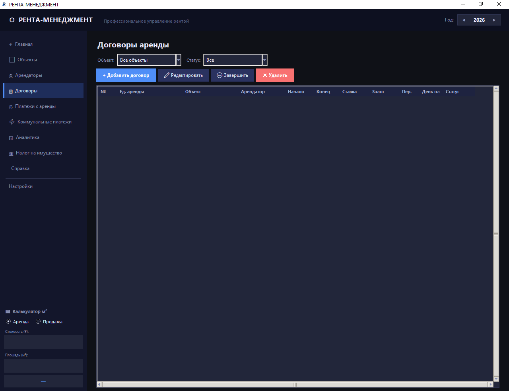
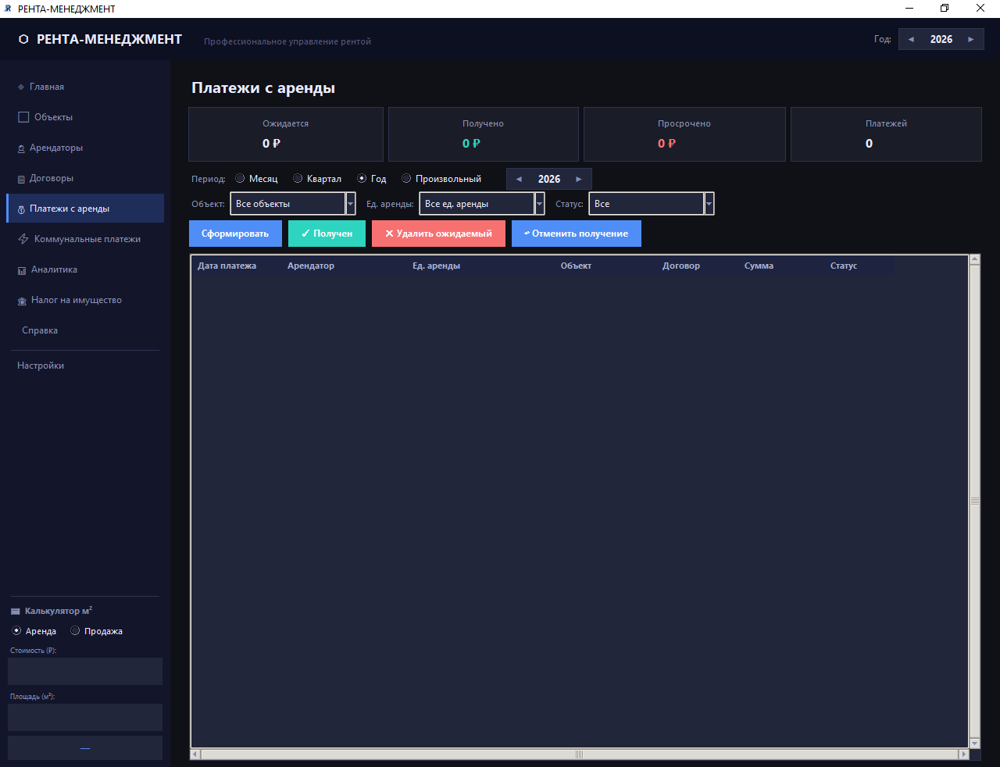
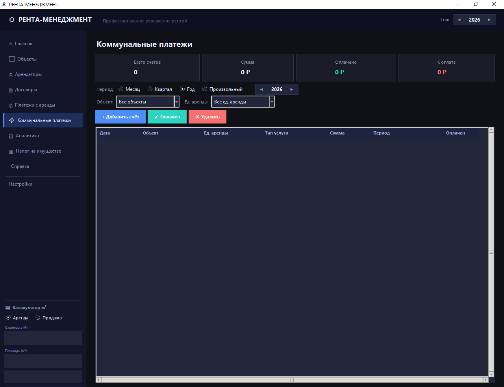
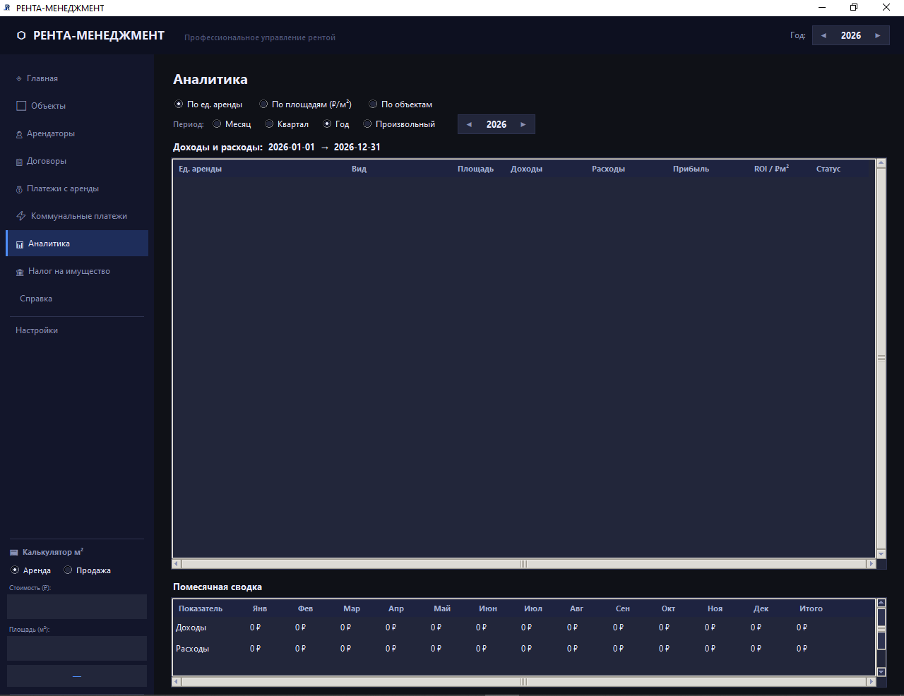

# РЕНТА-МЕНЕДЖМЕНТ · Renta Management

### Профессиональное управление арендой недвижимости · Professional rental property management

---

## 🇷🇺 Русский

Если вы сдаёте квартиры, кабинеты, студии или целые объекты — знакома ситуация: договоры отдельно, платежи в заметках, коммуналка в квитанциях, прибыль считается вручную.

**РЕНТА-МЕНЕДЖМЕНТ собирает всё в одной понятной системе. Разобраться можно за вечер.**

### Для кого

- 🏠 Собственники недвижимости
- 🏢 Арендодатели и управляющие объектами
- 📋 Те, кто ведёт несколько помещений одновременно

### Что умеет

- **Объекты и единицы аренды** — квартиры, кабинеты, студии, помещения; учёт площади, этажа, стоимости
- **Арендаторы** — физические и юридические лица, контакты, ИНН
- **Договоры аренды** — помесячная и посуточная аренда, залог, период, статус
- **Платежи с аренды** — график платежей, контроль просрочек, фильтр по периоду / объекту / статусу
- **Коммунальные платежи** — учёт расходов по объектам, отметка об оплате
- **Налог на имущество** — отдельный раздел учёта налоговых расходов
- **Аналитика** — доходы, расходы, прибыль, ROI и ₽/м² по каждому объекту; помесячная сводка за год
- **Главная панель** — сводка: доходы, расходы, прибыль, количество объектов, занятых и свободных единиц
- **Калькулятор м²** — быстрый расчёт стоимости аренды или продажи по площади
- **Полностью офлайн** — база данных хранится на вашем компьютере, интернет не нужен

---

## 🇺🇸 English

> **Note: the application interface is in Russian only.**

РЕНТА-МЕНЕДЖМЕНТ is a desktop property management tool for Russian-speaking landlords and property managers. It replaces scattered spreadsheets and notes with a single offline system: tenants, contracts, payments, utilities, taxes, and profitability analytics in one place.

### Key modules

| Module | What it does |
|---|---|
| Objects & units | Properties with floors, area, cost; rental units with status |
| Tenants | Individuals and companies, contacts, tax ID |
| Contracts | Monthly and daily rental, deposit, period, active/closed status |
| Rent payments | Payment schedule, overdue tracking, period/object/status filters |
| Utility payments | Expenses per object and unit, paid/unpaid status |
| Property tax | Separate tax expense tracking |
| Analytics | Revenue, expenses, profit, ROI, ₽/m² per unit; monthly breakdown |
| Dashboard | Live summary: income, expenses, profit, free vs occupied units |
| m² Calculator | Quick rent or sale price calculation by area |

---

## 🖥 Скриншоты · Screenshots

**Главная — сводка по всем объектам:**

**Объекты и единицы аренды:**

**Арендаторы:**

**Договоры аренды:**

**Платежи с аренды — контроль поступлений:**

**Коммунальные платежи:**

**Аналитика — доходы, расходы, ROI:**

---

## ⚙️ Системные требования · Requirements

- Windows 10 / 11 (64-bit)
- Portable — установка не требуется
- Интернет не нужен — база данных хранится локально

---

## 💼 Коммерческий продукт · Commercial product

Исходный код закрыт. РЕНТА-МЕНЕДЖМЕНТ — коммерческая программа под брендом **ShashevPro**.  
Source code is not public. Commercial product by **ShashevPro**.

**Купить лицензию · Buy a license:**

- 🌐 [shashevpro.ru](https://www.shashevpro.ru)
- 🛒 [kwork.ru/user/shashevpro](https://kwork.ru/user/shashevpro)
- ✉️ programmer@shashevpro.ru
- 💬 [vk.com/andrey_shashev](https://vk.com/andrey_shashev)

---

**© ShashevPro · Andrey Shashev** — commercial software, source not public.

